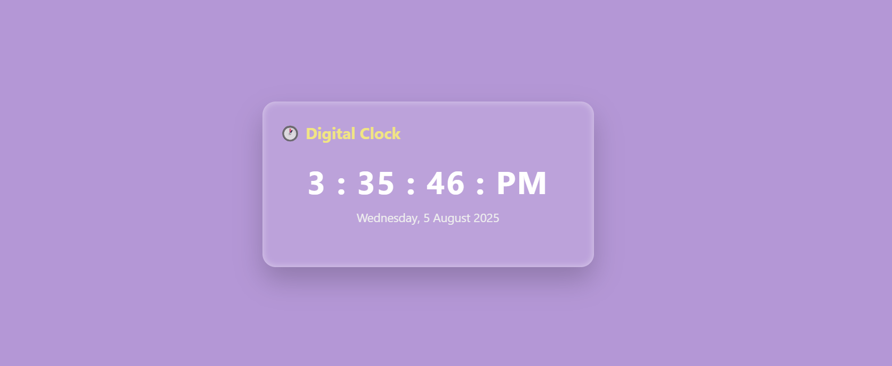

# 🕒 Digital Clock Web App

A simple and stylish digital clock web application built with **HTML**, **CSS**, and **JavaScript**. It displays the current time (12-hour format with AM/PM), the current date, and includes a button to toggle between light and dark modes.

---

## 🚀 Features

- ⏰ Real-time digital clock (updates every second)
- 📅 Displays current day, date, month, and year
- 🌗 Light/Dark mode toggle
- 💅 Responsive design with modern styling

---

## 📁 Project Structure

DigitalClock/
│
├── index.html # Main HTML file
├── style.css # CSS for styling the clock and layout
├── script.js # JavaScript for time, date, and mode toggle
└── README.md # Project description and usage

---

## 🖼️ Screenshot

- 

---

## 🔧 How to Use

1. Clone or download this repository.
2. Open the `index.html` file in your browser.
3. Click the "Toggle Mode" button to switch themes.

---

## 🛠️ Tech Stack

- **HTML5**
- **CSS3**
- **JavaScript (ES6+)**

---

## 📌 Learnings

- DOM manipulation with JavaScript
- Real-time date & time handling with `Date` object
- Working with `setInterval`
- Light/Dark theme toggling using event listeners and CSS changes

---

## ✅ To-Do / Improvements

- Add a theme switch icon 🌙/☀️
- Store user’s preferred mode in localStorage
- Make the design more responsive for mobile view
- Add animations to transitions between modes

---

## 👨‍💻 Author

**Anuj Banote**  
[\[GitHub Profile Link\] ](https://github.com/AnujBanote) 
[\[Portfolio or LinkedIn if applicable\]](https://www.linkedin.com/in/anuj-banote-379250232)

 
